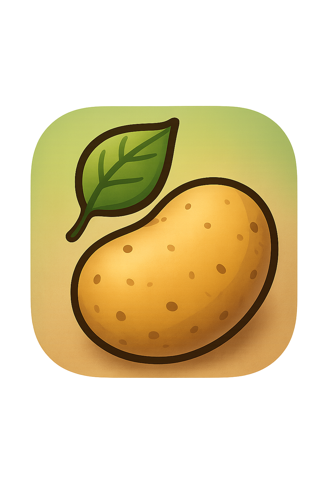

# PotaKu - Aplikasi Deteksi Penyakit Daun Kentang 🥔

<div align="center">
  
  <h3>Scan, Deteksi, Solusi!</h3>
  <p>Aplikasi mobile untuk deteksi penyakit pada tanaman kentang menggunakan teknologi Deep Learning(AI)</p>
</div>

## 📱 Tentang Aplikasi

PotaKu adalah aplikasi mobile berbasis Flutter yang memungkinkan petani dan pecinta tanaman untuk mendeteksi penyakit pada tanaman kentang dengan mudah. Aplikasi ini menggunakan teknologi machine learning untuk menganalisis foto daun kentang dan memberikan diagnosis serta rekomendasi pengobatan.

## ✨ Fitur Utama

- 📸 **Scan Penyakit**: Ambil foto daun kentang menggunakan kamera atau pilih dari galeri
- 🔍 **Deteksi AI**: Analisis otomatis menggunakan model machine learning
- 📊 **Hasil Akurat**: Deteksi 3 kondisi utama kentang:
  - Kentang Sehat (Healthy)
  - Early Blight (Bercak Daun Awal)
  - Late Blight (Busuk Daun)
- 💡 **Rekomendasi Pengobatan**: Panduan lengkap cara mengatasi penyakit
- 📚 **Katalog Informasi**: Database lengkap tentang penyakit kentang
- 🌙 **Dark/Light Mode**: Tema yang dapat disesuaikan
- 🎨 **UI Modern**: Antarmuka yang intuitif dan mudah digunakan

## 🛠️ Teknologi yang Digunakan

- **Framework**: 
  - Flutter
  - Flask
- **Language**: 
  - Python
  - Dart
- **AI/ML**: TensorFlow Lite (melalui API)
- **Camera**: Camera Plugin
- **Image Processing**: Image Picker
- **HTTP Client**: HTTP Package
- **State Management**: StatefulWidget

## 📋 Dependencies

```yaml
dependencies:
  flutter: sdk: flutter
  cupertino_icons: ^1.0.8
  image_picker: ^1.1.2
  camera: ^0.10.5+9
  flutter_launcher_icons: ^0.14.3
  http: ^1.1.0
```

## 🚀 Instalasi

### Prasyarat
- Flutter SDK 3.7.0 atau lebih baru
- Dart SDK
- Android Studio / VS Code
- Android device atau emulator

## 📱 Cara Penggunaan

1. **Buka Aplikasi**: Tunggu splash screen selesai
2. **Pilih Tab Scan**: Tap icon kamera di bottom navigation
3. **Ambil Foto**: 
   - Tap "Ambil Foto" untuk menggunakan kamera
   - Tap "Pilih dari Galeri" untuk memilih foto yang sudah ada
4. **Tunggu Analisis**: AI akan memproses foto secara otomatis
5. **Lihat Hasil**: 
   - Diagnosis penyakit
   - Tingkat kepercayaan
   - Penyebab penyakit
   - Gejala yang terlihat
   - Rekomendasi pengobatan
6. **Pelajari Lebih Lanjut**: Kunjungi tab "Info" untuk katalog lengkap

## 🔬 Model AI

Aplikasi ini menggunakan model machine learning:
- **Model**: Convolutional Neural Network (CNN)
- **Arsitektur**: MobileNetV2
- **Akurasi**: ~95% untuk deteksi penyakit kentang
- **Input**: Gambar RGB 224x224 pixels
- **Output**: Klasifikasi + confidence score

## 👨‍💻 Developer

- **Nama**: [Doni Julyano Risdianto]
- **Email**: [julyanorisdianto@gmail.com]
- **GitHub**: [@donniejr07](https://github.com/donniejr07)

<div align="center">
  <p>© 2025 PotaKu. All rights reserved.</p>
</div>
